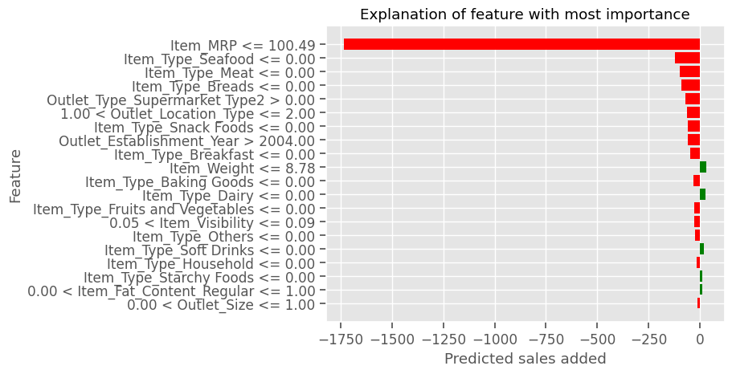
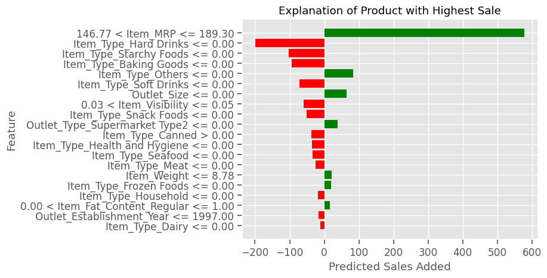

# Prediction of Product Sales

Author:
Yaman Shadid

## Introduction

The objective is to identify the optimal predictors that will enhance item sales within the context of a grocery store organization.

## Data

The dataset used in this project contains information about various products, such as item attributes, historical sales data, promotional activities, and other relevant features.

## Methods

1. **Data Collection and Source Selection:** The data was collected from [Big Mart Sales Prediction], which was chosen based on its relevance and reliability for the project's objectives.

2. **Data Cleaning:** The collected data underwent thorough cleaning to handle missing values, outliers, and inconsistencies to ensure the data's quality and integrity.

## Data Dictionary

## Key Visuals

There exists a strong correlation between the highest item price of the product and its corresponding item sales.

Item Sales based on Fat

Items labeled as "Regular Fat" have been observed to exhibit higher sales compared to those labeled as "Low Fat."

## Model

Utilizing a **Random Forest Model**, we conducted item sales predictions, achieving a testing data R-Squared value of 0.46 and an RMSE of 1093.

These metrics indicate that our model can approximate item sales with a variance of 0.46 from the target price.

## Reccomendations

Additional improvements are required to get a heightened level of optimization, leading to a more favorable model capable of accurately forecasting sales. This ongoing refinement process aims to enhance the model's predictive capabilities, ensuring its effectiveness in foreseeing sales trends and patterns.

## Interpretation for revisited model

**Linear regression:**

- For every unit increase in Item_Type_Seafood, while holding all other variables constant, the predicted response increases by approximately 338.50 units. This suggests that seafood items are associated with a higher predicted response compared to items that are not seafood. In practical terms, it might mean that seafood items are more valuable or more in-demand compared to other product types, leading to a higher predicted outcome (e.g., higher sales or higher prices).
- For every unit increase in Outlet_Type_Supermarket Type1, while keeping all other variables constant, the predicted response increases by about 337.43 units. This can be interpreted as outlets of type "Supermarket Type1" having a positive effect on the predicted outcome compared to other outlet types. Maybe, this type of supermarket tends to have better sales, more customers, or other factors leading to a higher outcome.
- For every unit increase in Item_Type_Breads, while holding all other variables constant, the predicted response increases by roughly 138.01 units. Breads, while having a positive association with the predicted outcome, don't seem to have as strong an influence as seafood based on the coefficients. However, it still indicates that bread items have a higher predicted response than some other types of products.

**Random Forest Feature**

**Top 5 features are:**
- Item_MRP
- Item_Visibility
- Item_Weight
- Outlet_Establishment_Year
- Outlet_Location_Type

## Interpretation of Shap Values in Summary Plots

**low sale lime explanation**

- The dominant factor shaping the prediction for this product is the Item MRP

**high sale explanation**

- Excluding Item MRP, the product with the highest sales value is Item_Type_Hard Drinks.
- Another significant influencer is the product's Maximum Retail Price (MRP).

**Shap Plots**

## For further information
For any additional questions, please contact **Ymmnshadid@gmail.com**

